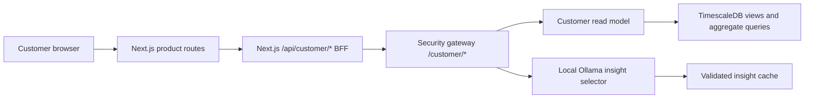

# Customer Dashboard Architecture

## Route Map

| Route | Audience | Purpose |
| --- | --- | --- |
| `/dashboard` | all authorized roles | Household energy and flexibility overview |
| `/dashboard/analytics` | all authorized roles | Bounded, downsampled energy trends |
| `/dashboard/devices` | all authorized roles | Customer-friendly simulated device state |
| `/dashboard/flexibility` | all authorized roles | Grid-event and safe approval workflow |
| `/dashboard/community` | all authorized roles | Aggregated, anonymized community comparison |
| `/dashboard/reports` | all authorized roles | Daily, weekly, monthly, device, and event reports |
| `/dashboard/settings` | all authorized roles | Profile, privacy, simulation, and access information |
| `/admin/operations` | `technical_admin` | Entry point to the preserved engineering console |
| existing technical routes | `technical_admin` | Existing pipeline validation and operations pages |

## Request Path

The browser never receives the edge API key and never connects directly to
Kafka, MQTT, Ollama, TimescaleDB, or an internal service.

## Role and Scope Model

### `household_user`

- session contains one required `household_id`
- all reads are forced to that household
- community data is aggregate only
- no technical routes
- approval actions are unavailable by default

### `enershare_operator`

- session contains an authorized `community_id`
- may list stable household pseudonyms in that community
- may select a household in that community
- may use existing review and approval workflow
- no technical diagnostics

### `technical_admin`

- product access
- community and household drill-down
- existing technical console access
- pipeline validation and operations data

The Next.js BFF and security gateway both enforce the scope. The Next.js
proxy is only a redirect convenience.

## Read Model

The product uses the following TimescaleDB read structures:

| Read structure | Type | Purpose |
| --- | --- | --- |
| `customer_household_power_15m` | SQL view | Downsampled total and device-type power |
| `customer_device_latest_state` | SQL view | Latest device readings pivoted into product fields |
| `customer_device_daily_energy` | SQL view | Meter deltas and bounded power-derived estimates |
| `customer_household_daily_energy` | SQL view | Household daily measured and estimated totals |
| `household_generated_insights` | table | Validated, expiring insight cache |

Source indexes support household/time, community/time, reading/time, and
dispatch history queries.

The views are deliberately transparent and refresh from source rows on each
bounded query. A production deployment can replace high-volume views with
continuous aggregates without changing the customer API contract.

## Customer API Inventory

| Gateway endpoint | Next.js endpoint | Result |
| --- | --- | --- |
| `GET /customer/households` | `GET /api/customer/households` | Authorized household selector |
| `GET /customer/summary` | `GET /api/customer/summary` | Overview metrics |
| `GET /customer/analytics` | `GET /api/customer/analytics` | Downsampled power and event overlays |
| `GET /customer/devices` | `GET /api/customer/devices` | Paginated device summaries |
| `GET /customer/flexibility` | `GET /api/customer/flexibility` | Event status and timeline |
| `GET /customer/insights` | `GET /api/customer/insights` | Cached validated insights |
| `POST /customer/insights/refresh` | `POST /api/customer/insights` | Authorized insight regeneration |
| `GET /customer/community` | `GET /api/customer/community` | Aggregate anonymized comparison |
| `GET /customer/reports` | `GET /api/customer/reports` | Bounded report data |
| `GET /customer/reports.csv` | `GET /api/customer/reports/csv` | Authorized CSV export |

Existing approval mutations continue through the existing gateway workflow.

## Insight Architecture

The insight layer does not send raw household payloads to the model.

1. Server queries calculate bounded aggregate facts.
2. Local Ollama receives only fact identifiers and aggregate values.
3. The model selects from an allowlist of insight categories.
4. Deterministic validation checks selected facts and confidence.
5. Customer text is rendered from verified facts.
6. The result is stored with an expiry time.

Prompts, batch identifiers, token usage, latency, and raw model output are not
returned to customer routes.

If Ollama is unavailable or an output cannot be validated, the UI shows that
an insight is not currently available. No insight is fabricated.

## Data Classification

| Classification | Examples | Product handling |
| --- | --- | --- |
| household private | household ID, device ID, usage series | scoped session only |
| operator restricted | pseudonymized household list | authorized community only |
| community aggregate | demand total, distribution, percentile | minimum group size and no identifiers |
| technical internal | SLM audit, Kafka, raw payloads, ports | admin operations only |
| public product text | safety notice, metric definitions | all authenticated users |

## Performance Design

- maximum analytics range: 31 days
- server-selected bucket sizes
- maximum chart points: 500
- device pagination: maximum 50 rows
- report pagination and date bounds
- bounded client refresh intervals with server responses marked `no-store`
- no unbounded raw telemetry API
- no 10,000-device client rendering
- product page error boundaries and loading skeletons

## Component Inventory

| Component | Purpose |
| --- | --- |
| `ProductShell` | Product navigation, role context, household selector, mobile drawer |
| `ProductPageHeader` | Consistent route title and bounded actions |
| `SimulationNotice` | Persistent no-real-control boundary |
| `MetricCard` | Supported headline metric with unit and provenance detail |
| `ProductPanel` | Reusable content surface |
| `EnergyUsageChart` | Responsive, downsampled multi-device power chart |
| `FlexibilityScoreCard` | Explainable score or explicit insufficient-data state |
| `AIInsightCard` | Validated customer insight without model diagnostics |
| `EmptyProductState` | Unsupported or absent-data state |
| `ProductErrorState` | Sanitized recoverable failure state |
| `LoadingGrid` | Stable loading skeleton |

## Database View Inventory

| Object | Source | Browser exposure |
| --- | --- | --- |
| `customer_household_power_15m` | normalized readings | bounded aggregate API only |
| `customer_device_latest_state` | normalized readings | paginated product fields only |
| `customer_device_daily_energy` | meter deltas and sampled power | bounded product fields only |
| `customer_household_daily_energy` | device daily energy | bounded report/summary fields |
| `household_generated_insights` | validated aggregate insight facts | customer text and support summary only |

## Safety Boundary

The product does not add a real execution endpoint. Existing review and
approval actions retain their gateway checks. Every command result remains
simulated and the product always displays:

> Controlled demonstration using simulated energy devices. No real household
> device control is enabled.
