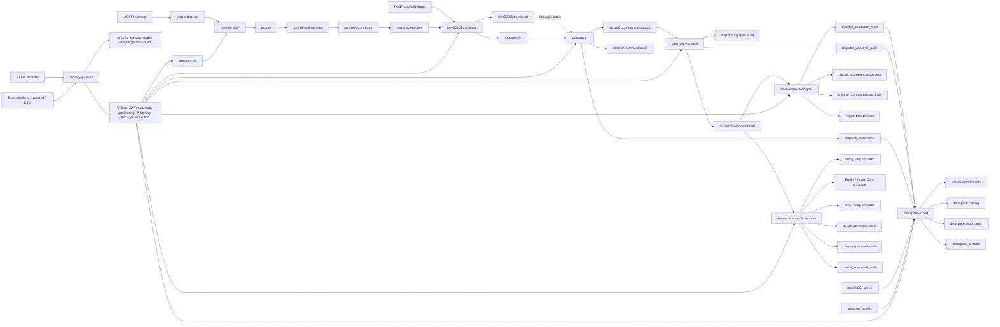

# Technical Architecture

This document explains the AD-FLEX technical architecture, including the production-style local security edge and simulated device-specific API translation layer.

## Full Diagram

## Plain-English Explanation

The system starts at the local production-style edge. External HTTP clients, a future frontend, and DSO requests should call `security-gateway` on port `3010`. The gateway performs local API key validation, JWT-ready middleware, rate limiting, IP filtering, DPI-style request inspection, correlation ID forwarding, and audit logging before routing to internal services.

Household telemetry can still arrive over MQTT for local development. HTTP telemetry now enters the production-style local path through the gateway, which forwards it to the ingestion API. MQTT telemetry continues through the MQTT subscriber.

Next, the semantic connector turns readings into energy-aware meaning. It uses local Phi-3 Mini through Ollama as the primary semantic interpretation layer for every telemetry reading. Deterministic SAREF4ENER mapping remains active as validation and fallback when the SLM is unavailable, invalid, low confidence, or inconsistent with known readings.

The IEEE 2030.5 translator foundation turns semantic readings and DSO grid signals into simple IEEE 2030.5-style payloads. It uses terminology such as `MirrorMeter`, `MirrorMeterReading`, `DERStatus`, `DERControlCandidate`, and DSO-facing gateway context where appropriate. This helps explain grid and DER concepts, but it is not a certified IEEE 2030.5 stack.

The aggregator creates dispatch proposals from grid signals. The approval workflow lets a reviewer review, approve, reject, and mark proposals ready. The mock dispatch adapter creates safe simulated dispatch results. The device command translator also consumes the approved ready event and converts it into simulated Shelly Plug, Enode / Easee Core, and Heat Pump API commands. No real household device is controlled.

Finally, the dataspace export service creates safe IDS/ENERSHARE-ready summaries for outside stakeholders. It minimizes fields, pseudonymizes household and device identifiers, and records export audit rows.

## Technical Explanation

The architecture is event-driven after the gateway. Kafka topics connect each service boundary, while TimescaleDB stores durable records and audit history. Services are small Node.js processes with Docker Compose orchestration.

The system intentionally separates:

- data ingestion from normalization
- external edge security from internal service behavior
- semantic mapping from IEEE 2030.5-style translation
- proposal creation from approval
- approval from mock dispatch
- approved command readiness from simulated device-specific API translation
- mock dispatch from dataspace export

This separation is the main safety feature. Each phase leaves an auditable handoff.

## Service Roles

| Service | Role |
| --- | --- |
| `security-gateway` | Local production-style external entry point and audit layer. |
| `ingestion-api` | Receives HTTP telemetry and publishes `raw.telemetry`. |
| `mqtt-subscriber` | Receives MQTT telemetry and publishes `raw.telemetry`. |
| `engine` | Validates and normalizes telemetry into `normalized.telemetry`. |
| `semantic-connector` | Uses local Phi-3 Mini as the primary semantic interpretation layer with deterministic SAREF4ENER validation and fallback. |
| `ieee20305-translator` | Builds simplified IEEE 2030.5-style resources and accepts mock DSO signals. |
| `aggregator` | Creates safe dispatch command proposals only. |
| `approval-workflow` | Manages proposal status transitions and publishes ready events. |
| `mock-dispatch-adapter` | Simulates device command preparation and simulated results. |
| `shelly-simulator` | Provides a local simulated Shelly Plug API. |
| `enode-simulator` | Provides a local simulated Enode / Easee Core charger API. |
| `heat-pump-simulator` | Provides a local simulated Heat Pump API. |
| `device-command-translator` | Converts approved ready commands into simulated device-specific API calls. |
| `dataspace-export` | Provides minimized and pseudonymized IDS/ENERSHARE-ready export assets. |

## Data Flow From Telemetry To Dataspace Export

1. External HTTP traffic enters through `security-gateway` on port `3010`.
2. The gateway authenticates, rate limits, filters, inspects, adds a correlation ID, audits the decision, and forwards valid requests.
3. Telemetry reaches `ingestion-api` through `POST /telemetry` or the compatibility alias `POST /api/ingest`, while MQTT telemetry reaches `mqtt-subscriber`.
4. The raw event is published to `raw.telemetry`.
5. The engine writes raw and normalized records, then publishes `normalized.telemetry`.
6. The semantic connector writes `semantic_events` and publishes `semantic.enriched`.
7. The IEEE translator writes `ieee20305_events` and publishes `ieee20305.translated`.
8. A DSO grid signal can be posted through the gateway to `/dso/grid-signal`, creating a `GridSignal` event on `grid.signals`.
9. The aggregator writes a proposal to `dispatch_commands` and publishes `dispatch.command.proposed`.
10. The approval workflow updates proposal status and publishes `dispatch.command.ready` only after approval.
11. The mock adapter consumes the ready event, simulates dispatch, writes `dispatch_execution_audit`, and publishes mock sent/result events.
12. In parallel, the device command translator consumes the same approved ready event, selects simulated Shelly Plug, Enode / Easee Core, and Heat Pump devices, translates the load request into their API language, writes `device_command_audit`, and publishes `device.command.result` and `device.command.audit`.
13. Dataspace export reads the Phase 1 to Phase 8 audit/event tables and returns minimized summaries through the gateway.

## Safety Boundary

The system does not control real household devices.

The external safety boundary starts at `security-gateway`. Direct internal ports remain open locally for development, but the production-style path is through port `3010`.

The execution safety boundary is at `mock-dispatch-adapter` and `device-command-translator`. Both only accept ready events that include:

- `no_execution: true`
- `execution_blocked: true`
- `status: ready_to_dispatch`

Every mock command includes:

- `simulated: true`
- `no_real_execution: true`
- `execution_mode: mock`

Every simulated device API command includes:

- `simulated: true`
- `no_real_execution: true`
- `execution_mode: simulated_device_api`

The Shelly, Enode, and Heat Pump services are local simulators. They do not use real credentials and do not reach real devices.

The simulator layer follows a small BaseDevice-style contract. Each simulated device exposes `tick()` and `getTelemetry()` behavior. `getTelemetry()` can return both the existing pipeline fields and the simulator-compatible shape:

- `deviceId`
- `deviceType`
- `timestamp`
- `data`

## Where The Security Edge Is Used

The local security edge is `security-gateway` on port `3010`. It maps to a future AWS API Gateway plus WAF architecture.

Local controls:

- API key header: `x-edge-api-key`
- JWT-ready middleware, disabled locally by default
- per-client IP rate limiting
- IP allowlist and blocklist
- JSON content-type and request-size checks
- DPI-style request inspection for obvious SQL injection, XSS, path traversal, and command injection patterns
- correlation ID generation and forwarding
- audit rows in `security_gateway_audit`
- Kafka audit events on `security.gateway.audit`

Future AWS mapping:

- API Gateway for the public API
- WAF for rate limiting, IP filtering, and inspection rules
- Cognito or API Gateway JWT authorizer for identity
- ACM and API Gateway custom domain for TLS/mTLS

## Where SLM Is Used

The SLM is used only inside `semantic-connector`. In the final local pipeline it is the primary semantic interpretation path for every telemetry reading when `SLM_ENABLED=true` and `SLM_PRIMARY=true`.

The connector calls local Ollama/Phi-3 Mini first, validates the JSON response, checks confidence and unit compatibility, and then runs deterministic SAREF4ENER validation for known readings. If the SLM is unavailable, times out, returns invalid JSON, produces low confidence, suggests an unsupported concept, or conflicts with deterministic validation, the connector falls back to deterministic SAREF4ENER mapping. If neither path can safely map the reading, the event is stored as `unmapped`.

Semantic events show the mapping path with values such as:

- `slm_primary`
- `deterministic_fallback`
- `unmapped`

The semantic payload also records `slm_called`, `slm_model`, `slm_confidence`, `deterministic_validation`, `validation_source`, and `fallback_reason` without storing raw prompts.

## Where IEEE 2030.5-Style Translation Is Used

The IEEE 2030.5-style translator is `ieee20305-translator`. It creates simplified resources such as:

- `MirrorMeterReading`
- `MirrorMeter`
- `DERStatus`
- `DERControlCandidate`
- `GridSignal`

This is a foundation translation layer for the local demo environment, not a certified IEEE 2030.5 implementation.

## Where Dataspace Export Happens

The dataspace export service runs on port `3006`. It exposes catalog and export endpoints, applies data minimization, pseudonymizes household and device identifiers, writes `dataspace_exports`, and publishes audit events.

It is an IDS/ENERSHARE-ready export foundation, not a certified ENERSHARE connector. Real connector credentials, connector runtime, contract negotiation, and external publication are future deployment inputs.

## Where Device API Translation Happens

The device command translator runs on port `3009`. It consumes `dispatch.command.ready` after approval and translates a load reduction request into simulated endpoint calls:

- Shelly Plug simulator on port `3007`: `turn_off`, `turn_on`, `reduce_load`, `restore_load`
- Enode / Easee Core simulator on port `3008`: `pause_charging`, `resume_charging`, `reduce_charging_power`, `restore_charging_power`
- Heat Pump simulator on port `3011`: `reduce_load`, `restore_load`, `set_temperature`, `boost_heat`

This implements the bidirectional load management workflow: the DSO signal moves forward through semantic and grid translation, then the approved command moves backward into simulated device-specific API language. It remains simulated and suitable for a local demo environment.
