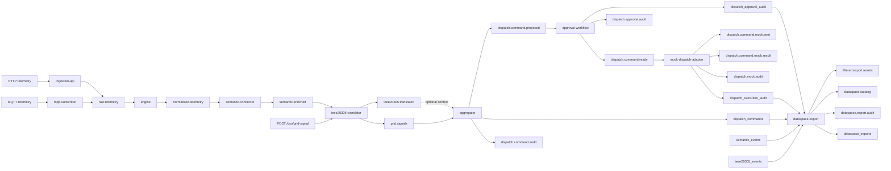

# Final Architecture

This document explains the final AD-FLEX demo architecture after Phases 1 to 9.

## Full Diagram

## Plain-English Explanation

The system starts with household telemetry. It accepts readings through HTTP or MQTT, puts them on Kafka, normalizes them, and stores them in TimescaleDB.

Next, the semantic connector turns readings into energy-aware meaning. Known readings use deterministic SAREF4ENER mapping. Unknown readings can optionally use a local Phi-3 Mini model through Ollama, but only if SLM support is enabled.

The IEEE 2030.5 translator foundation turns semantic readings and DSO grid signals into simple IEEE 2030.5-style payloads. This helps explain grid and DER concepts, but it is not a certified IEEE 2030.5 stack.

The aggregator creates dispatch proposals from grid signals. The approval workflow lets a reviewer review, approve, reject, and mark proposals ready. The mock dispatch adapter then simulates a command and result. No real household device is controlled.

Finally, the dataspace export service creates safe summaries for outside stakeholders. It minimizes fields, pseudonymizes household and device identifiers, and records export audit rows.

## Technical Explanation

The architecture is event-driven. Kafka topics connect each service boundary, while TimescaleDB stores durable records and audit history. Services are small Node.js processes with Docker Compose orchestration.

The system intentionally separates:

- data ingestion from normalization
- semantic mapping from IEEE 2030.5-style translation
- proposal creation from approval
- approval from mock dispatch
- mock dispatch from dataspace export

This separation is the main safety feature. Each phase leaves an auditable handoff.

## Service Roles

| Service | Role |
| --- | --- |
| `ingestion-api` | Receives HTTP telemetry and publishes `raw.telemetry`. |
| `mqtt-subscriber` | Receives MQTT telemetry and publishes `raw.telemetry`. |
| `engine` | Validates and normalizes telemetry into `normalized.telemetry`. |
| `semantic-connector` | Adds deterministic or optional SLM-assisted semantic mapping. |
| `ieee20305-translator` | Builds simplified IEEE 2030.5-style resources and accepts mock DSO signals. |
| `aggregator` | Creates safe dispatch command proposals only. |
| `approval-workflow` | Manages proposal status transitions and publishes ready events. |
| `mock-dispatch-adapter` | Simulates device command preparation and simulated results. |
| `dataspace-export` | Provides minimized and pseudonymized dataspace-style export assets. |

## Data Flow From Telemetry To Dataspace Export

1. Telemetry enters through `POST /telemetry` or MQTT.
2. The raw event is published to `raw.telemetry`.
3. The engine writes raw and normalized records, then publishes `normalized.telemetry`.
4. The semantic connector writes `semantic_events` and publishes `semantic.enriched`.
5. The IEEE translator writes `ieee20305_events` and publishes `ieee20305.translated`.
6. A DSO grid signal can be posted to `/dso/grid-signal`, creating a `GridSignal` event on `grid.signals`.
7. The aggregator writes a proposal to `dispatch_commands` and publishes `dispatch.command.proposed`.
8. The approval workflow updates proposal status and publishes `dispatch.command.ready` only after approval.
9. The mock adapter simulates dispatch, writes `dispatch_execution_audit`, and publishes mock sent/result events.
10. Dataspace export reads the audit/event tables and returns minimized summaries.

## Safety Boundary

The system does not control real household devices.

The safety boundary is at `mock-dispatch-adapter`. It only accepts ready events that include:

- `no_execution: true`
- `execution_blocked: true`
- `status: ready_to_dispatch`

Every mock command includes:

- `simulated: true`
- `no_real_execution: true`
- `execution_mode: mock`

## Where SLM Is Used

The SLM is used only inside `semantic-connector`, only for unknown or unmapped readings, and only when `SLM_ENABLED=true`.

Known readings use deterministic SAREF4ENER mapping first and never call the SLM.

## Where IEEE 2030.5-Style Translation Is Used

The IEEE 2030.5-style translator is `ieee20305-translator`. It creates simplified resources such as:

- `MirrorMeterReading`
- `DERStatus`
- `DERControlCandidate`
- `GridSignal`

This is a foundation and demo translation layer, not a certified IEEE 2030.5 implementation.

## Where Dataspace Export Happens

The dataspace export service runs on port `3006`. It exposes catalog and export endpoints, applies data minimization, pseudonymizes household and device identifiers, writes `dataspace_exports`, and publishes audit events.

It is a dataspace-style export foundation, not a certified ENERSHARE connector.
