# Local Platform Enterprise Architecture

This diagram represents the validated local AD-FLEX smart grid communication platform. It is production-style in sequence, but still runs locally through Docker Compose. Future AWS, utility, and certified connector integrations are shown as future components only.

```mermaid
flowchart TB
  classDef implemented fill:#e8f5ee,stroke:#1f7a4d,stroke-width:1.5px,color:#103c27
  classDef important fill:#e8f0ff,stroke:#2457c5,stroke-width:2px,color:#10234f
  classDef storage fill:#fff7e6,stroke:#b87503,stroke-width:1.5px,color:#4d3100
  classDef future fill:#f7f7f7,stroke:#777,stroke-width:1.5px,stroke-dasharray: 6 4,color:#444
  classDef safety fill:#fff0f0,stroke:#b42318,stroke-width:1.5px,color:#5f1212

  subgraph L1["Households / Community Assets"]
    Shelly["Shelly Plug Simulator"]
    Enode["Enode / Easee EV Charger Simulator"]
    HeatPump["Heat Pump Simulator"]
    FutureDevices["Future Devices"]
  end

  subgraph L2["Security Layer - All External Traffic"]
    Auth["API Authentication"]
    Gateway["Security Gateway"]
    RateLimit["Rate Limiting"]
    Firewall["Firewall / IP Filtering"]
    DPI["DPI-Style Request Inspection"]
    Corr["Correlation IDs"]
    SecAudit["Security Audit Logging"]
  end

  subgraph L3["Ingestion Layer"]
    Rest["REST Telemetry API"]
    Mqtt["MQTT Broker + Subscriber"]
    Validation["Telemetry Validation"]
    Normalizer["Engine JSON Normalization"]
  end

  subgraph L4["KAFKA DIGITAL SPINE"]
    Kafka["Apache Kafka Event Streaming"]
    RawTopic["raw.telemetry"]
    NormalizedTopic["normalized.telemetry"]
    SemanticTopic["semantic.enriched"]
    GridTopic["grid.signals"]
    DispatchTopics["dispatch.* topics"]
    DeviceTopics["device.command.* topics"]
    DataspaceTopics["dataspace.* topics"]
  end

  subgraph L5["Semantic Intelligence Layer - SLM-Driven Semantic Mapping"]
    Ollama["Ollama"]
    Phi3["Phi-3 Mini (PRIMARY)"]
    Semantic["Semantic Connector"]
    Saref["SAREF4ENER Validation"]
    Fallback["Deterministic Fallback Only"]
  end

  subgraph L6["Data Storage Layer"]
    Timescale["PostgreSQL / TimescaleDB"]
    RawStore["Raw + Normalized Telemetry"]
    SemanticStore["Semantic Data"]
    AuditStore["Audit Records"]
    CommandStore["Command History"]
  end

  subgraph L7["DSO / Grid Services Layer"]
    IEEE["IEEE 2030.5 Translator"]
    Protocol["MirrorMeter / MirrorMeterReading / DERStatus"]
    DSOParser["DSO Grid Signal Parser"]
    GridSignals["Grid Signal Processing"]
  end

  subgraph L8["Flexibility Management Layer"]
    Aggregator["Aggregator"]
    Proposal["Dispatch Proposal Engine"]
    Approval["Approval Workflow"]
    MockDispatch["Mock Dispatch Adapter"]
    DeviceTranslator["Device API Translation Layer"]
  end

  subgraph L9["Dataspace Layer"]
    Dataspace["Dataspace Export Service"]
    Catalog["Catalog + Export APIs"]
    Pseudo["Pseudonymized Data Exchange"]
    EnershareReady["ENERSHARE-Ready Foundation"]
  end

  subgraph L10["Customer Application Layer"]
    Console["Customer Operator Console"]
    Health["Platform Health"]
    SLMView["SLM Monitoring"]
    DispatchView["Dispatch Visibility"]
    DataView["Dataspace Visibility"]
  end

  subgraph L11["Future Production Components"]
    AWS["AWS Deployment"]
    Utility["Real DSO / Utility Integration"]
    RealDevices["Real Device Provider Credentials"]
    ProdDataspace["Production Dataspace Connector"]
    OIDC["OIDC / Cognito / Auth0"]
    MTLS["TLS / mTLS"]
  end

  Shelly --> Gateway
  Enode --> Gateway
  HeatPump --> Gateway
  FutureDevices -.-> Gateway

  Auth --> Gateway
  RateLimit --> Gateway
  Firewall --> Gateway
  DPI --> Gateway
  Gateway --> Corr
  Gateway --> SecAudit

  Gateway --> Rest
  Gateway --> DSOParser
  Mqtt --> RawTopic
  Rest --> Validation --> RawTopic
  RawTopic --> Kafka
  Kafka --> NormalizedTopic
  NormalizedTopic --> Normalizer
  Normalizer --> SemanticTopic

  NormalizedTopic --> Semantic
  Ollama --> Phi3 --> Semantic
  Semantic --> Saref
  Saref --> Semantic
  Fallback --> Semantic
  Semantic --> SemanticTopic

  SemanticTopic --> IEEE
  IEEE --> Protocol
  IEEE --> Timescale
  DSOParser --> GridSignals --> GridTopic

  GridTopic --> Aggregator --> Proposal --> DispatchTopics
  DispatchTopics --> Approval --> DispatchTopics
  Approval --> MockDispatch --> DeviceTopics
  Approval --> DeviceTranslator
  DeviceTranslator --> Shelly
  DeviceTranslator --> Enode
  DeviceTranslator --> HeatPump

  RawTopic --> RawStore
  NormalizedTopic --> RawStore
  Semantic --> SemanticStore
  IEEE --> AuditStore
  Aggregator --> CommandStore
  Approval --> AuditStore
  MockDispatch --> AuditStore
  DeviceTranslator --> AuditStore
  Timescale --> RawStore
  Timescale --> SemanticStore
  Timescale --> AuditStore
  Timescale --> CommandStore

  Timescale --> Dataspace
  Dataspace --> Catalog
  Dataspace --> Pseudo
  Dataspace --> EnershareReady
  Dataspace --> DataspaceTopics

  Console --> Gateway
  Console --> Health
  Console --> SLMView
  Console --> DispatchView
  Console --> DataView
  Gateway --> Console
  Timescale --> Console

  AWS -.-> Gateway
  Utility -.-> DSOParser
  RealDevices -.-> DeviceTranslator
  ProdDataspace -.-> Dataspace
  OIDC -.-> Auth
  MTLS -.-> Gateway

  class Shelly,Enode,HeatPump,Auth,Gateway,RateLimit,Firewall,DPI,Corr,SecAudit,Rest,Mqtt,Validation,Normalizer,IEEE,Protocol,DSOParser,GridSignals,Aggregator,Proposal,Approval,MockDispatch,DeviceTranslator,Dataspace,Catalog,Pseudo,EnershareReady,Console,Health,SLMView,DispatchView,DataView implemented
  class Kafka,RawTopic,NormalizedTopic,SemanticTopic,GridTopic,DispatchTopics,DeviceTopics,DataspaceTopics,Ollama,Phi3,Semantic,Saref,Fallback important
  class Timescale,RawStore,SemanticStore,AuditStore,CommandStore storage
  class FutureDevices,AWS,Utility,RealDevices,ProdDataspace,OIDC,MTLS future
```

## Layer Summary

### Households / Community Assets

Implemented locally through simulators:

- Shelly Plug Simulator
- Enode / Easee EV Charger Simulator
- Heat Pump Simulator

Future devices can be added behind the same gateway and device translation contracts.

### Security Layer

All production-style external HTTP traffic enters through `security-gateway` on port `3010`. The gateway performs API key validation, JWT-ready structure, rate limiting, IP filtering hooks, DPI-style request inspection, correlation IDs, and audit logging.

### Ingestion Layer

Telemetry enters through REST or MQTT. The ingestion and subscriber services validate JSON payloads and publish raw telemetry into Kafka. The engine normalizes readings into the common telemetry format.

### Kafka Digital Spine

Kafka is the event backbone. It carries raw telemetry, normalized telemetry, semantic enrichment, IEEE 2030.5-style translations, grid signals, dispatch workflow events, device command events, security audit events, and dataspace audit events.

### Semantic Intelligence Layer

The semantic connector uses local Ollama / Phi-3 Mini as the primary semantic interpretation path. Deterministic SAREF4ENER mapping remains active as validation and fallback. This layer is explicitly SLM-driven but resilient when Ollama is unavailable or when SLM output is invalid.

### Data Storage Layer

TimescaleDB stores telemetry, semantic events, IEEE 2030.5-style events, dispatch proposals, approval audit records, mock execution audit records, device command audit records, dataspace exports, and security gateway audit records.

### DSO / Grid Services Layer

The IEEE 2030.5 translator creates compatibility-style payloads such as MirrorMeterReading and DERStatus. The DSO grid signal endpoint converts external grid requests into internal GridSignal events. This is IEEE 2030.5-compatible foundation work, not certified compliance.

### Flexibility Management Layer

The aggregator creates safe dispatch proposals. The approval workflow moves proposals through review, approval, and ready-to-dispatch status. Mock dispatch and device command translation simulate bidirectional control preparation without real device execution.

### Dataspace Layer

The dataspace export service provides minimized, pseudonymized, IDS/ENERSHARE-ready exports. It does not contain real connector credentials, production contract negotiation, or certified ENERSHARE integration.

### Customer Application Layer

The Customer Operator Console gives a client-facing view of pipeline health, semantic mapping, DSO requests, dispatch state, mock execution, device command translation, dataspace export, and AWS readiness. Browser traffic uses Next.js API routes, which call only the security gateway.

## Implementation Status

Implemented and validated:

- Local Docker Compose platform
- Security gateway
- Event-driven Kafka pipeline
- SLM-primary semantic mapping
- Deterministic fallback
- TimescaleDB persistence
- IEEE 2030.5-style translation foundation
- Aggregator and approval workflow
- Mock dispatch and simulated device command translation
- Dataspace export foundation
- Customer Operator Console local mode

Future components:

- AWS deployment
- Real DSO integration
- Real device provider credentials
- Production identity provider
- TLS/mTLS
- Certified IEEE 2030.5 implementation
- Certified ENERSHARE connector

