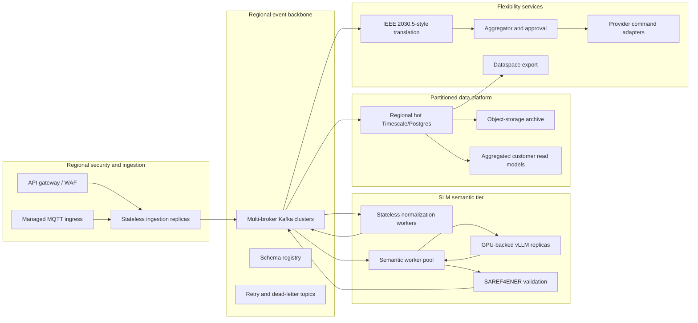

# Million-Device Infrastructure Roadmap

## Status and claim boundary

This document is an architecture roadmap. It is not evidence that AD-FLEX
has processed one million devices. The completed local validation results and
their measured limits are reported separately. Any production sizing must be
re-benchmarked on the selected cloud, Kafka, inference, and database
platforms before deployment.

The roadmap preserves the current logical business flow:

```text
authenticated telemetry
  -> durable event streaming
  -> normalization
  -> mandatory SLM semantic interpretation
  -> deterministic semantic validation
  -> semantic and IEEE 2030.5-style records
  -> flexibility proposal and approval
  -> safe device-provider translation
  -> privacy-aware dataspace export
```

Measured sizing inputs and the 10,000/100,000/1,000,000-asset projection are
kept in
[`million-device-scale-out-model.md`](million-device-scale-out-model.md).
Those figures are modeled from the local 1,000-asset evidence and remain
unvalidated at the projected population sizes.

## Design principles

1. Scale horizontally without changing the semantic or safety contract.
2. Partition by tenant, region, household, or stable device identity.
3. Apply backpressure instead of dropping telemetry.
4. Keep the SLM mandatory and record an explicit terminal outcome for every
   normalized reading.
5. Commit Kafka offsets only after durable idempotent processing.
6. Keep command execution separately authorized and disabled until a
   production consent and safety model exists.
7. Serve dashboards from aggregated read models, never raw event scans.
8. Treat regional failure, replay, retention, and cost controls as first-class
   production requirements.

## Target production topology



## Distributed workload generation

Production-scale validation should use multiple independent generators rather
than one process or one container per device.

- Each generator owns a deterministic shard of virtual-device identities.
- A central run manifest assigns non-overlapping device and household ranges.
- Generator clocks are synchronized, but reporting offsets remain
  deterministic and staggered.
- Evidence streams to regional object storage and is merged by run ID.
- A control plane can pause or reduce arrival rate when the measured backlog
  exceeds a safety threshold.
- Load generators must report accepted, rejected, retried, and unconfirmed
  requests separately.

## Kafka and event routing

A million-device-class deployment requires a multi-broker Kafka deployment or
an operationally equivalent managed service.

- Partition count is derived from measured throughput, worker concurrency,
  recovery time, and expected regional peaks.
- Stable keys use tenant and household or device identity.
- Normalization and semantic workers use separate consumer groups.
- Retry and dead-letter topics preserve reading identity and failure reason.
- Replication factor is at least three across failure domains.
- Producers use acknowledgements and idempotence suitable for durable
  telemetry.
- Consumers use manual durable offset completion and cooperative rebalancing.
- Lag, rebalance duration, retry age, and oldest unprocessed event age drive
  autoscaling.
- Partition increases are rehearsed with explicit new-partition offset
  initialization before production traffic is admitted.

## Stateless service replicas

Security gateway, ingestion, normalization, IEEE translation, and export APIs
should remain stateless behind regional load balancers. Runtime configuration
and secrets come from a managed secret store. Readiness checks must verify
required downstream dependencies without making every transient dependency
failure remove all capacity.

Services should use:

- bounded connection pools;
- bulk or pipelined database writes;
- circuit breakers and bounded retries;
- correlation IDs and OpenTelemetry traces;
- graceful termination long enough to finish or safely release in-flight
  Kafka work;
- immutable versioned images and progressive rollout.

## Mandatory SLM inference pools

The SLM tier is the principal capacity-planning boundary because every
normalized semantic reading must be submitted to a model.

- Use multiple GPU-backed vLLM replicas behind a provider-independent internal
  endpoint.
- Preserve strict structured output and reading-ID reconciliation.
- Route a batch to one inference replica and record replica identity.
- Scale on queue age, readings per second, GPU utilization, and p95 latency.
- Keep batch size and concurrency bounded by model accuracy and GPU memory.
- Use retry budgets so invalid structured output cannot create an inference
  storm.
- A failed reading becomes explicitly safely unmapped after its retry policy;
  deterministic code must not synthesize a replacement mapping.
- Model and prompt versions are immutable audit dimensions.
- Canary new model versions against recorded, privacy-reviewed semantic test
  fixtures before rollout.

The production GPU type and replica count cannot be selected from laptop
results alone. The measured local rate provides a baseline, while production
vLLM throughput requires a dedicated benchmark on candidate GPUs.

## Data storage and retention

At larger scale, operational and analytical workloads need separate access
paths.

- Partition hot data by tenant/region and time.
- Keep globally unique reading and message identities in durable uniqueness
  tables or an equivalent idempotency service.
- Batch inserts and size connection pools from measured database throughput.
- Use compressed Timescale chunks or equivalent time-series compression.
- Apply retention by data class: raw telemetry, normalized readings, semantic
  audit, command audit, and aggregate summaries need different periods.
- Move expired raw detail to encrypted cold object storage when policy allows.
- Maintain daily and 15-minute aggregate tables for customer queries.
- Test point-in-time recovery and regional restoration.
- Enforce tenant and household authorization in the read service, not only in
  the browser.

## Dashboard and reporting

The customer console should never render one card per device at population
scale.

- Query server-side aggregates and paginated device inventories.
- Downsample time series by requested range.
- Use bounded date windows and continuation tokens.
- Cache non-sensitive community aggregates with short, explicit freshness.
- Keep technical lag and inference diagnostics in the protected operations
  route.
- Publish run progress as aggregate counts: submitted, normalized, terminal
  SLM outcomes, mapped, safely unmapped, and remaining backlog.

## Regional processing

Telemetry should enter the nearest approved region. Personally or
commercially sensitive data remains in-region unless a governed export policy
permits movement.

- A global control plane distributes configuration, schemas, and approved
  model versions.
- Regional data planes own ingestion, Kafka, inference, and hot storage.
- Cross-region replication carries minimized aggregate or recovery data only.
- Tenant and utility boundaries are explicit partition and authorization
  dimensions.

## Backpressure and overload behavior

The platform must degrade safely:

1. reject or defer new burst traffic with a retryable status before memory is
   exhausted;
2. preserve already accepted events in Kafka;
3. lower generator or device reporting frequency through an authorized
   configuration path;
4. scale normalization and inference workers within bounded limits;
5. prioritize queue age while preserving per-device ordering;
6. expose explicit backlog and estimated-clearance metrics;
7. never convert queue acceptance into a successful end-to-end result.

## Reliability and disaster recovery

- Deploy across at least three failure domains per production region.
- Define recovery-point and recovery-time objectives for each data class.
- Back up Kafka configuration, schemas, database data, and secret metadata.
- Rehearse broker loss, inference-pool loss, database failover, and region
  evacuation.
- Verify that replays remain idempotent and do not duplicate semantic, IEEE,
  approval, or command-audit rows.
- Keep dispatch disabled during uncertain recovery states until authorization
  and state reconciliation complete.

## Observability

The production operations plane should collect:

- telemetry and normalized-reading rates;
- Kafka lag and oldest-event age;
- SLM batch rate, size, retries, invalid output, and latency percentiles;
- safely-unmapped rate by model, field, and device category;
- database write latency and conflict counts;
- raw-to-semantic and raw-to-IEEE latency;
- CPU, RAM, GPU, network, and storage saturation;
- customer API latency and authorization failures;
- dispatch safety flags and command-audit completeness.

Metrics, logs, and traces require tenant-safe labels. Raw prompts, raw
household payloads, credentials, and personal data must not be placed in
observability labels.

## Security and identity

Future deployment requires:

- production OAuth/OIDC identities and short-lived service credentials;
- per-tenant and per-household authorization;
- mTLS or equivalent workload identity between services;
- managed key rotation and encrypted storage;
- WAF, rate limits, IP policy, and request inspection at the edge;
- signed device identity and consent records before any real control;
- tamper-evident approval and command audit;
- privacy review for semantic inference and dataspace exports.

## Cost controls

GPU inference, retention, and cross-region traffic dominate cost risk.

- Autoscale from queue age with minimum and maximum replica bounds.
- Benchmark model quantization and batch size against mapping quality.
- Keep raw retention only as long as policy and operational need require.
- Store aggregates separately from raw detail.
- Budget alerts should track inference GPU-hours, Kafka storage, database
  growth, object-storage retrieval, and egress.
- Capacity tests should report cost per million readings when a production
  platform is selected.

## Controlled rollout

1. Reproduce the local 1,000-asset workload in a production-like test region.
2. Benchmark candidate vLLM GPUs and select a validated batch/concurrency
   profile.
3. Validate 10,000 assets with multiple generator and service replicas.
4. Validate 100,000 assets with multi-broker Kafka and partitioned storage.
5. Run regional soak, failure, replay, and recovery tests.
6. Increase toward million-device-class traffic only after every previous
   stage has zero silent loss, bounded lag, idempotent durable completion, and
   accepted operational cost.

## Inputs still required

- reporting interval and readings per update by device contract;
- regional and tenant distribution;
- recovery and retention objectives;
- selected Kafka and database platforms;
- candidate GPU types and measured vLLM throughput;
- production identity, consent, and device-control policy;
- real connector contracts and credentials;
- security, privacy, and regulatory review.
