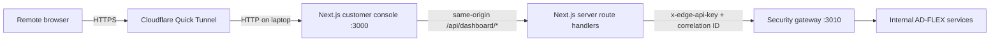

# Public Laptop Demo Architecture

## Implemented Boundary

The customer console already uses server-side Next.js route handlers.
Browser components call relative `/api/...` paths, and the route handlers
call `GATEWAY_BASE_URL` with `EDGE_API_KEY` on the server. Polling is bounded
to 30-60 second intervals; no Server-Sent Events are used.

Public-demo mode now adds:

- a dedicated `/api/dashboard/*` BFF namespace;
- environment-only credentials and session signing;
- per-client login throttling;
- an HttpOnly cookie marked secure for Cloudflare-forwarded HTTPS;
- a public route allowlist that hides technical pages and legacy APIs;
- loopback-only Docker port publishing;
- repeatable startup, validation, tunnel, and shutdown scripts.

## Public Request Path



Only port 3000 is selected as the tunnel origin. Kafka, Zookeeper,
TimescaleDB, Ollama, MQTT, simulators, ingestion, the gateway, and internal
service ports are never tunnel origins.

The dashboard process itself listens on `127.0.0.1`. No router port-forward
or inbound Windows firewall rule is required.

## Same-Origin BFF

Customer browser traffic uses:

- `/api/dashboard/households`
- `/api/dashboard/summary`
- `/api/dashboard/analytics`
- `/api/dashboard/devices`
- `/api/dashboard/devices/:deviceId`
- `/api/dashboard/flexibility`
- `/api/dashboard/community`
- `/api/dashboard/reports`
- `/api/dashboard/insights`
- `/api/dashboard/approvals/*`

These handlers enforce the signed application session, validate bounded
query parameters, add household identity from the verified session, and call
only the configured server-side gateway URL. Existing local API routes remain
for backward compatibility but are unavailable in public-demo mode.

Device inventory responses are paginated and filtered server-side. Device
detail requests carry a pseudonymous household selector for operator accounts
and are re-authorized by the gateway.

## Authentication Boundary

Public-demo credentials and the session signing secret come only from:

- `DEMO_USERNAME`
- `DEMO_PASSWORD`
- `DEMO_SESSION_SECRET`

The login route uses a generic failure response, throttles repeated attempts
per client address, and creates a signed HttpOnly cookie. The cookie is marked
secure when the request arrives through HTTPS. Passwords and gateway keys are
never rendered or returned to the browser.

Normal product routes are available to the demo operator. `/admin/operations`
and legacy technical API routes are not public-demo routes.

## Network Boundary

Docker-published ports bind to `127.0.0.1`. This preserves local development
access while preventing direct access from other network interfaces. The
Cloudflare process receives only `http://127.0.0.1:3000`.

Quick Tunnel is temporary and suitable for a controlled demonstration. It is
not a production identity, availability, or networking solution. Stopping
`cloudflared` invalidates the temporary URL; named Docker volumes remain
untouched.

## Availability Behavior

Dashboard queries use bounded polling rather than SSE. A failed gateway or
downstream service returns a sanitized unavailable state. The product shell,
navigation, safety notice, and previously rendered page remain usable when an
individual read request fails.

## Trust Boundaries

```text
Internet
  Cloudflare temporary edge URL
    Next.js product pages and /api/dashboard/* only
      signed demo session
        server-only EDGE_API_KEY
          loopback security gateway
            internal Docker pipeline
```

Quick Tunnel encrypts the remote browser connection, but it does not replace
a production identity provider, managed WAF, durable ingress, custom domain,
formal consent model, or service-to-service mTLS.
