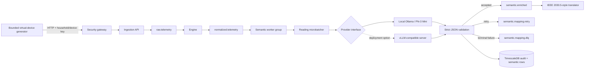

# SLM Scalability Architecture

## Implemented Data Path

## Mandatory SLM Boundary

Every normalized reading enters a provider request. There is no deterministic replacement mapping and no mapping cache. Deterministic SAREF4ENER logic is a post-inference guardrail: it checks known field/property/unit/concept relationships, rejects unsafe output, triggers a retry when configured, and otherwise records a terminal safely-unmapped result.

The strict response identifies each reading independently with `reading_id`. Missing, duplicate, or unexpected IDs cannot be accepted. Free-form text, command content, unsupported ontology values, impossible unit relationships, and low confidence are rejected.

## Horizontal Scale Units

- **Kafka partitions** distribute household- or device-keyed readings.
- **Semantic workers** share one consumer group. Each partition is owned by one active worker.
- **Inference replicas** sit behind the provider endpoint. Ollama supports small local validation; a vLLM-compatible deployment provides the intended high-throughput path.
- **TimescaleDB writes** use stable reading IDs and unique time/identity indexes to prevent duplicate final rows during replay.

Offsets are resolved and committed only after every reading in the Kafka batch has a durable terminal outcome. Rebalance or process failure before durability leaves the offset uncommitted for replay.

## Backpressure And Failure

Kafka is the bounded backlog between normalization and semantic inference. Metrics expose per-partition lag, batch queue time, inference latency, retries, invalid output, safely-unmapped outcomes, and missing terminal evidence. The provider concurrency limiter prevents uncontrolled local requests. The circuit breaker cools down after repeated failures, then permits a real probe; it does not bypass the mandatory SLM submission.

## Safety Boundary

The scalability path does not enable physical control. Approval, mock dispatch, and device command translation retain `no_real_execution=true`. IEEE 2030.5 and ENERSHARE/IDS wording describes compatibility foundations, not certification.

